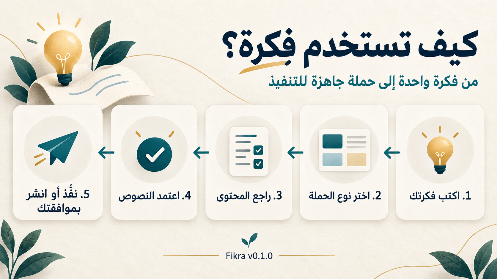

# Fikra | فِكرة

**An Arabic-first skill that turns one idea into a concise or comprehensive social media campaign.**

**مهارة عربية تحوّل فكرة واحدة إلى حملة مختصرة أو متكاملة للسوشيال ميديا.**

Fikra analyzes an idea before writing, proposes different content angles, adapts the campaign to each platform, creates short- and long-video scripts and visual briefs, and reviews the final output for credibility, originality, Arabic quality, and execution readiness.

تحلل فِكرة الموضوع قبل الكتابة، وتقترح زوايا مختلفة، وتكيّف المحتوى لكل منصة، وتنتج سيناريوهات للفيديوهات القصيرة والطويلة وموجزات بصرية، ثم تراجع الحملة من حيث المصداقية والأصالة وجودة العربية وقابلية التنفيذ.

## How Fikra Works | كيف تعمل فِكرة؟



## Campaign Modes | أوضاع الحملة

- **Concise / مختصرة:** One angle, ready-to-use content for every requested platform, a brief video script, visual direction, and a call to action. محور واحد ومحتوى جاهز لكل منصة وسيناريو مختصر وتوجيه بصري ودعوة للتفاعل.
- **Comprehensive / متكاملة:** Multiple angles, detailed content, carousel, full video script, alternatives and A/B testing, repurposing, execution schedule, and performance indicators. زوايا متعددة ومحتوى تفصيلي وكاروسيل وسيناريو كامل وبدائل واختبار وإعادة توظيف وجدول ومؤشرات أداء.

If no campaign mode is specified, Fikra asks which you want. Single-deliverable requests retain their scope.

إذا لم تحدد الوضع، تسألك فِكرة: «هل تريد حملة مختصرة أم متكاملة؟» ولا توسّع طلب منشور واحد إلى حملة كاملة.

## What Fikra Does | ماذا تفعل فِكرة؟

Depending on the selected mode, Fikra can produce:

- Idea DNA and core campaign message
- Three distinct content angles
- Platform-specific social media posts
- Instagram carousel structures
- Instagram Reel and TikTok scripts
- Facebook page posts, Reels and Stories
- YouTube Shorts and long-video scripts, titles, descriptions and thumbnail briefs
- Community Post drafts where appropriate and supported
- LinkedIn posts
- X posts or threads
- Hook variations
- Visual briefs
- Captions, keywords, and relevant hashtags
- Testing alternatives
- Content repurposing maps
- Execution cards
- Credibility and brand-voice reviews

بحسب الوضع المختار، تستطيع فِكرة إنتاج:

- بصمة الفكرة ورسالة الحملة
- ثلاث زوايا محتوى مختلفة
- منشورات مخصصة لكل منصة
- هيكل Carousel لمنصة Instagram
- سيناريوهات Reels وTikTok
- منشورات صفحات Facebook وReels وStories
- سيناريوهات YouTube Shorts والفيديو الطويل وعناوينها وأوصافها وموجزات صورها المصغرة
- مسودات Community Posts عندما تكون مناسبة ومدعومة
- منشورات LinkedIn
- منشورات أو سلاسل X
- خطافات متنوعة
- موجزات بصرية
- أوصاف وكلمات مفتاحية وهاشتاغات مرتبطة بالمحتوى
- بدائل للاختبار
- خريطة لإعادة استخدام المحتوى
- بطاقة تنفيذ
- مراجعة للمصداقية وصوت العلامة

## Supported Platforms | المنصات المدعومة

The first release provides guidance for these six platforms:

- Instagram
- TikTok
- LinkedIn
- X
- Facebook
- YouTube

يدعم الإصدار الأول هذه المنصات الست: Instagram وTikTok وLinkedIn وX وFacebook وYouTube. يُختار لكل حملة ما يناسب هدفها وجمهورها، دون فرض كل المنصات أو الصيغ.

### Facebook وYouTube

يدعم Facebook منشورات الصفحات النصية والمصورة، والصور المفردة والمتعددة أو الكاروسيل عندما تدعمها الأداة والصيغة، وReels وStories وأوصاف الفيديو والتعليقات المصاحبة والدعوات للتفاعل. يُعاد تكييف محتوى Instagram لجمهور Facebook، مع خطة نشر وقياس مناسبة، دون نسخه تلقائيًا.

يدعم YouTube خطط وسيناريوهات Shorts والفيديو الطويل، وبنية المشاهد والنص المنطوق والظاهر على الشاشة، والعناوين والأوصاف والكلمات الموضوعية وموجز الصورة المصغرة ونصها. تُضاف الترجمة وملفاتها وCommunity Posts بحسب الأدوات ودعم الحساب، وتُنتج المقتطفات من مادة فيديو فعلية. يُحدد نطاق مدة الفيديو الطويل ويُؤكد عند تأثيره في الإنتاج، وتُبنى افتتاحية صادقة وأقسام مفيدة وخاتمة طبيعية.

تُفصل السيناريوهات عن الفيديوهات الفعلية والصور المصغرة وCommunity Posts. لا يُعتبر السيناريو أو البرومبت فيديو جاهزًا للرفع، ولا تُنشأ فصول زمنية نهائية قبل وجود فيديو نهائي ومدد مقاسة. يتطلب إنتاج الفيديو أو الصورة المصغرة اختيار أداة وموافقتك، ثم فحص الملفات والصوت والصورة والترجمة المطلوبة.

Publishing support depends on the actual tool, format, account and permissions. Facebook and YouTube guidance does not promise every format or an installed integration. Analytics use only returned metrics, keep platform definitions separate, and do not treat views alone as proof of success.

## Target Users | المستخدمون

Fikra supports three user profiles:

1. Content creators and personal brands
2. Small businesses
3. Social media managers and agencies

تخدم فِكرة صنّاع المحتوى والعلامات الشخصية، والمشروعات الصغيرة، ومديري السوشيال ميديا والوكالات.

## Languages | اللغات

Fikra provides guidance for:

- Professional Modern Standard Arabic
- Simplified Modern Standard Arabic
- Neutral social-media Arabic
- Light Gulf Arabic
- Professional English
- Bilingual Arabic–English campaigns

Arabic is the primary language. Fikra avoids literal translation and prioritizes natural Arabic writing.

العربية هي اللغة الأساسية، وتركز فِكرة على الكتابة الطبيعية بدلاً من الترجمة الحرفية.

## Example Request | مثال للاستخدام

```text
Use $fikra to create an Arabic social media campaign about how artificial intelligence can assist employees instead of replacing them.

User mode: Content creator
Campaign mode: Comprehensive
Objective: Education and discussion
Platforms: LinkedIn, Instagram, and X
Language: Professional Arabic
```

أو بالعربية:

```text
استخدم $fikra لتحويل فكرة استخدام الذكاء الاصطناعي في مساعدة الموظفين بدلاً من استبدالهم إلى حملة عربية للسوشيال ميديا.

نوع المستخدم: صانع محتوى
وضع الحملة: متكاملة
الهدف: التوعية وفتح النقاش
المنصات: LinkedIn وInstagram وX
النبرة: عربية مهنية
```

## How It Works | كيف تعمل؟

Fikra follows this workflow:

1. Understand the idea, essential context, and requested campaign mode.
2. Extract the Idea DNA.
3. Develop one angle for concise campaigns or three for comprehensive campaigns.
4. Recommend the strongest angle.
5. Build platform-specific content.
6. Produce video and visual directions.
7. Review credibility, originality, and Arabic quality.
8. Deliver an organized execution package; perform requested tool-backed work only after capability verification and the required approvals.

تبدأ فِكرة بفهم الفكرة والجمهور والهدف، ثم تستخرج رسالتها الأساسية، وتطوّر محورًا واحدًا أو زوايا متعددة بحسب الوضع، وتبني حملة مناسبة لكل منصة، وتراجعها قبل التسليم.

## Choose the Next Step | اختر الخطوة التالية

بعد اكتمال خطة حملة كاملة، إذا لم تحدد الخطوة التالية، تسأل فِكرة: **«اكتملت خطة الحملة. ماذا تريد أن أنفذ الآن؟»** وتعرض الخيارات المناسبة فقط مع شرح قصير: استلام النصوص والخطة، إنشاء الصور، إنتاج الفيديوهات، إنتاج جميع المواد، تجهيز المعاينة، أو النشر والجدولة بعد الموافقة، ومتابعة النتائج بعد النشر. لا تعرض فيديو لحملة لا تحتاجه، ولا تفترض توفر أداة أو موافقتك على النشر. إذا طلبت خطوة محددة تنتقل إلى مسارها مباشرة.

يمكنك الاكتفاء بالنصوص، تصميم بعض الصور فقط، تعديل مادة، العودة أو التوقف، واختيار النشر اليدوي دون ربط حساب. قبل استخدام أداة تعرض فِكرة ما ستفعله وتطلب موافقتك، وتذكر التكلفة أو الأرصدة عندما تكون معلومة فقط. عند غياب الأداة تشرح الربط من وثائق رسمية، ثم تتحقق بأمان وتستكمل من موضع التوقف.

عند اختيار جميع المواد، تُفصل النصوص المكتملة عن الوسائط الناقصة، وتُعرض الأدوات وخطة الإنتاج للموافقة، ثم تُنتج الملفات وتُفحص على مراحل. تتحدث الحزمة و`execution-status.md` بعد كل مرحلة مع حفظ الأصول والإصدارات المعدلة؛ لا يُعتبر السيناريو ملف فيديو مكتملًا.

المعاينة تعرض لكل مادة المنصة والحساب المتصل والنص والملف والمقاس والصيغة والموعد والمنطقة الزمنية وحالة المراجعة والنواقص، دون نشر. النشر أو الجدولة يحتاجان موافقة مستقلة على المادة والحساب والموعد بعد المعاينة النهائية. التحليلات تستخدم البيانات المتاحة والمأذون بقراءتها فقط، وتفصل النتائج الفعلية عن الاستنتاجات والتوصيات.

يمكن أن تتضمن الخطوة التالية، بحسب المواد المطلوبة: تصميم منشورات Facebook، إنتاج Facebook Reel أو YouTube Short أو فيديو YouTube طويل، إنشاء الصورة المصغرة، وتجهيز المعاينة ثم الرفع أو الجدولة بعد الربط والمعاينة والموافقة.

For full campaigns with no chosen next step, Fikra offers a short, relevant menu. Specific requests bypass it. Each chosen route preserves user scope, tool approvals and resumable progress; preview never publishes, publication requires its own final approval, and analytics use observed data only. See the [guided execution workflow](fikra/references/execution-and-connections.md).

## Safety and Credibility | الأمان والمصداقية

Fikra does not:

- Invent statistics, studies, sources, or testimonials
- Present unsupported claims as facts
- Guarantee reach, engagement, leads, or sales
- Copy another creator's content
- Publish, schedule, or make consequential external changes without immediate approval for each operation
- Request passwords or access tokens in chat
- Claim integrations or external results without verification
- Retain persistent user or brand data without an authorized storage mechanism

Campaign assets remain drafts until approved for a specific external action. Preparing a campaign does not authorize publication.

لا تختلق فِكرة الأرقام أو المصادر أو شهادات العملاء، ولا تضمن الانتشار أو المبيعات، ولا تنشر المحتوى تلقائياً. جميع المخرجات مسودات تحتاج إلى مراجعة بشرية.

## Project Structure | هيكل المشروع

```text
fikra-skill/
├── fikra/
│   ├── SKILL.md
│   ├── agents/
│   │   └── openai.yaml
│   └── references/
│       ├── arabic-style.md
│       ├── campaign-output.md
│       ├── evaluations.md
│       ├── execution-and-connections.md
│       ├── platforms.md
│       └── safety-and-credibility.md
├── plugins/fikra/            # generated Codex distribution
├── scripts/build_plugin.py
├── docs/                    # compatibility and release evidence
├── LICENSE
└── README.md
```

## Installation | التثبيت

Clone the repository:

```bash
git clone https://github.com/SHADO-VIP/fikra-skill.git
```

تعليمات التثبيت والاستخدام منفصلة في [دليل Codex وClaude وReplit](docs/compatibility.md)، مع جدول يبيّن ما اختُبر فعلًا وما يحتاج اختبارًا حيًا. يبقى [`fikra/`](fikra/) مصدر الحقيقة المشترك.

## Codex Plugin v0.1

Build and verify the generated package from the repository root:

```bash
python3 scripts/build_plugin.py
python3 scripts/build_plugin.py --check
```

Distribute [`plugins/fikra/`](plugins/fikra/), including its hidden `.codex-plugin/` directory and license. Its skill files are generated from `fikra/`; never edit the generated copy. No MCP, Apps, Hooks or marketplace are bundled. Installation requires a real configured marketplace; see the [documented installation and validation steps](docs/compatibility.md#codex-حزمة-plugin).

لنتائج الاختبارات وحدود الجاهزية، راجع [تقرير v0.1](docs/release-v0.1.md). لا يعني التوافق البنيوي اختبارًا حيًا على Claude أو Replit.

## Current Scope | نطاق الإصدار الحالي

Fikra can use verified, available tools and permissions to generate final images/designs, produce video/audio and edits, publish or schedule content, read account/post analytics, and propose improvements from results. This repository provides instructions, not bundled integrations or undocumented API support. Capability varies by environment and connected account.

عند توفر الأدوات والصلاحيات، تستطيع فِكرة إنشاء الصور والتصاميم النهائية وإنتاج الفيديو والصوت والمونتاج ونشر المحتوى أو جدولته وقراءة التحليلات واقتراح تحسينات مبنية على النتائج. هذا المستودع يقدّم تعليمات عمل، ولا يتضمن تكاملات جاهزة أو مفاتيح API.

For missing access, Fikra gives connection steps based on available official documentation, uses official authentication such as OAuth where available, and verifies completion with a safe read. It preserves a non-secret task checkpoint and resumes after verification. If connection fails, it hands off copy and available files for manual publishing, identifying media still needing production.

تُفحص القدرات والحسابات قبل الوعد بالتنفيذ. عند نقص الربط، تُشرح الخطوات من الوثائق الرسمية دون تخمين أو طلب أسرار داخل المحادثة، ثم يُتحقق بقراءة آمنة ويُستكمل العمل من نقطة التوقف. عند تعذر الربط تُسلّم النصوص والملفات المتاحة للنشر اليدوي مع توضيح ما لم يُنتج بعد.

Before each publication, scheduling operation, or consequential external change, Fikra presents the final content, media, platform, account, and time/timezone, then requests explicit approval immediately before execution. It considers minimum permissions and tool costs, and reports actual results and returned IDs/links, including partial failures.

قبل كل نشر أو جدولة أو تعديل خارجي مؤثر، تُعرض معاينة للمحتوى والوسائط والحساب والمنصة والموعد والمنطقة الزمنية وتُطلب موافقة صريحة مباشرة. الموافقة على إعداد الحملة لا تعني الموافقة على نشرها. تُراعى أقل الصلاحيات والتكلفة، وتُعرض النتيجة الفعلية بما فيها الفشل أو النجاح الجزئي.

For images and videos, Fikra separates campaign-angle approval, final visible-text approval, and subsequent tool permission. Before creating or editing any media, including with built-in tools, Fikra names the discovered tool, describes the output and known costs, and waits for explicit permission. When several tools fit, it compares them and leaves the choice to you. Video production may require separately authorized tools for scenes, voiceover and editing; a script or prompt is not a finished video. Original files are preserved and edits are versioned and inspected.

تعرض فِكرة نص كل شريحة أو مشهد ومعناه لاعتمادك؛ اعتماد زاوية الحملة مستقل عن اعتماد النص، ثم تأتي موافقة الأداة. قبل إنشاء أي وسائط أو تعديلها، حتى بأداة مدمجة، تعرض فِكرة اسم الأداة والمخرجات والتكلفة المعلومة وتنتظر إذنك الصريح. عند وجود بدائل، تقارنها وتترك الاختيار لك. ربط الحساب وقراءة التحليلات لا يمنحان موافقة على النشر؛ وتُطلب موافقة مستقلة إذا احتاجت التحليلات صلاحية جديدة.

A complete campaign requested as saved files gets its own local `output/<campaign-name>/` package with `campaign.md`, `README.md`, `execution-status.md`, platform copy/scripts, real media and production prompts. Pending files are tracked without fake media; interrupted work resumes in the same package. `/output/` is ignored by Git and must not contain secrets, personal information or customer data. Text-only requests do not force file creation.

عند طلب حفظ حملة كاملة، تُجمع ملفاتها داخل مجلد مستقل في `output/`، مع خطة الحملة ودليل الاستخدام وحالة كل مخرج. تبقى الملفات محلية ومتجاهلة في Git، وتُستكمل العناصر الناقصة داخل الحزمة نفسها دون استبدال الأصول أو اختراع ملفات وسائط. لا تُحفظ أسرار أو بيانات شخصية أو بيانات عملاء.

تُحفظ مواد Facebook وYouTube داخل `facebook/` و`youtube/` عند استخدامهما: نصوص الفيديو في `scripts/`، والفيديوهات الفعلية في `videos/`، والصور المصغرة الفعلية في `thumbnails/`، وملفات الترجمة الفعلية في `subtitles/`، والصور في `images/`، مع تحديث حالة كل عنصر دون ملفات وهمية.

يُعرض اسم صفحة Facebook أو قناة YouTube بعد التحقق الآمن من الاتصال. ربط Facebook لا يمنح إذنًا لـInstagram أو العكس، وربط قناة YouTube لا يجيز الرفع. لكل رفع أو نشر أو جدولة موافقة مستقلة؛ النتائج الغامضة لا تُعاد تلقائيًا.

إدارة الإعلانات المدفوعة والميزانيات والاستهداف والفوترة خارج هذا الإصدار وتحتاج وضعًا مستقلًا لاحقًا. لا تُنشئ فِكرة أو تطلق إعلانات Facebook أو YouTube؛ يمكنها كتابة فكرة أو مسودة محتوى إعلاني عند الطلب فقط.

See [Execution and Connections](fikra/references/execution-and-connections.md) for the complete workflow.

## Roadmap | خريطة التطوير

Planned future work may include:

- Additional Arabic dialects
- Content archive analysis
- Comment-to-idea workflows
- Brand voice profiles
- Packaged optional platform integrations
- Plugin and MCP packaging
- A future SaaS product after validating real demand

## Contributing | المساهمة

Contributions, test cases, Arabic language improvements, and platform-specific feedback are welcome.

نرحب بالمساهمات وحالات الاختبار وتحسينات اللغة العربية والملاحظات المتعلقة بمنصات السوشيال ميديا.

## License | الترخيص

Fikra is available under the [MIT License](LICENSE).

## Author | المطوّرة

Created by [Shadia Sarhan](https://github.com/SHADO-VIP).
